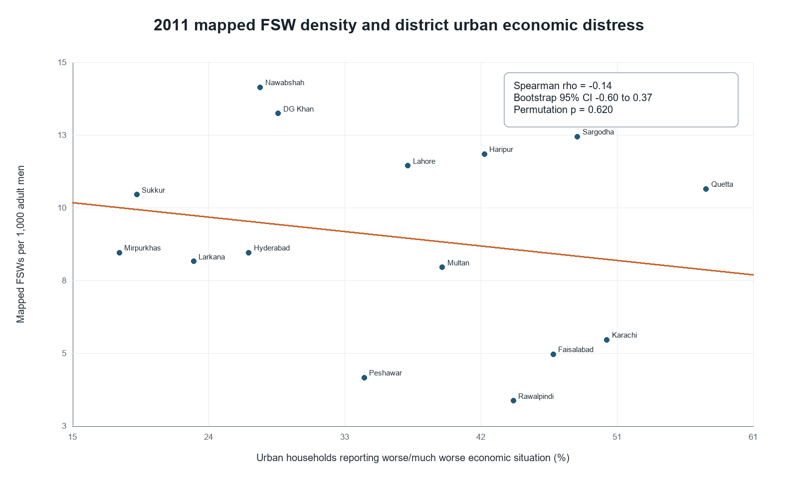

# Economic deterioration tracks FSW expansion; recovery tracks a plateau

> Authoritative synthesis of the currently assembled Pakistani evidence. The frozen primary test remains distinct from the later exploratory analyses.

## Executive summary

- **Simple answer: yes, the complete available Pakistani survey series contains an economic signal.** The mapped FSW population expanded rapidly as growth weakened and inflation rose, then its growth sharply decelerated toward a plateau as the economy improved.
- **The same-city stock comparison is the clearest test.** In the four-city continuous panel, annualized mapped-population growth slowed from 9.65% during deterioration to 5.30% during recovery. In the six-city panel followed through 2016-17, it slowed from 14.39% to 0.87%.
- **The plateau should be read as a stock-flow result.** Economic recovery need not remove people who already entered sex work. The sharp fall in net population growth is consistent with fewer newcomers while the existing population persists because exit into other work is difficult. The surveys observe the resulting population stock, not entry and exit separately.
- **Density is not the main economic signal.** In 2011, recent household economic deterioration had only a weak inverse association with mapped FSW density (rho=-0.138; bootstrap 95% CI -0.597 to +0.372; permutation p=0.6195).
- **Market scale is the clearest 2011 relationship.** Recent deterioration was positively associated with absolute mapped FSW numbers (rho=+0.657) and implied adult-male population scale (rho=+0.625), while chronic deprivation was negatively associated with both total (rho=-0.700) and scale (rho=-0.718) but weakly positively associated with density (rho=+0.315).
- **Sex-work organisation carries a stronger economic pattern than density.** Recent deterioration was associated with greater kothikhana share (rho=+0.618) and lower cellphone share (rho=-0.515); the separately published network table showed more kothikhana-based FSWs per operator (rho=+0.552).
- **The cross-period pattern is expansion followed by deceleration, not expansion followed by disappearance.** The ten common cities' mapped total expanded 66.25% during the 2006-07 to 2011 deterioration. Later recovery left the accumulated population in place while its growth slowed sharply.
- **Across economic indicators and FSW markers, work setting is the clearest longitudinal signal.** Inflation was perfectly rank-aligned with the home-minus-street balance across the three rounds with typology data (rho=+1.000); GDP growth showed the expected but weaker inverse direction (rho=-0.500). Kothikhana share did not behave as a clean temporal macro marker.
- **What this supports:** the signal lies in changes in population growth and organisation, not in expecting density or the total population to fall immediately when conditions improve.

## 1. Evidence assembled and usable

| round_id | mapping_period | cities | density_available | typology_available | economic_period | status |
|---|---|---|---|---|---|---|
| 2006_07 | 2006-07 | 12 | False | True | 2006-07 | structural replication |
| 2011 | 2011 | 15 | True | True | 2010-11 | primary |
| 2014 | 2014 | 4 | False | True | 2014-15 | structural replication |
| 2016_17 | 2015-17 | 18 | False | False | 2014-15 | context only |

The repository contains 49 unique city-round records. These rounds constitute the complete published Pakistani series available for this FSW-economic comparison; there is no separate national longitudinal dataset waiting to validate it. The analysis therefore asks what the total available evidence shows, while preserving the measurement differences between rounds. Only 2011 reports city-specific FSW density per 1,000 adult men. The 2006-07 and 2014 sources support typology comparisons. The 2016-17 source supports printed city counts only; its 18 city rows sum to 71,315 while its printed grand total is 64,829, so common-city rows are used without substituting the inconsistent grand total.

The economic evidence has two levels:

- **Local household conditions:** urban district percentages reporting a worse or much worse economic situation than one year earlier, plus poverty, female illiteracy and sanitation deprivation where available.
- **National context:** GDP growth, CPI inflation, unemployment where reported, and per-capita income from the corresponding Pakistan Economic Survey overviews.

## 2. Frozen primary result: 2011 density

The prespecified question was whether cities with greater recent urban economic deterioration had a higher mapped FSW density. The observed relationship was weakly inverse: rho=-0.138, not positive. The bootstrap interval (-0.597 to +0.372) spans both directions and the permutation p-value is 0.6195.

The estimate was directionally stable to individual-city omission: all leave-one-city-out estimates remained negative, ranging from -0.264 to -0.031. Across the prespecified city subsets, estimates ranged from -0.150 to +0.183. This means no single city creates the inverse direction, but the magnitude is small and sensitive enough that density is not a strong signal.

| analysis | method | n | estimate | p_value |
|---|---|---|---|---|
| primary_pair_pearson | pearson | 15 | -0.196 | 0.4845 |
| urban_poverty | spearman | 15 | 0.281 | 0.3110 |
| urban_female_illiteracy | spearman | 15 | 0.316 | 0.2512 |
| urban_sanitation_deprivation | spearman | 15 | -0.061 | 0.8288 |
| all_area_economic_distress | spearman | 15 | -0.091 | 0.7466 |
| log_density_pearson | pearson | 15 | -0.227 | 0.4149 |

The secondary domains are not interchangeable. Poverty and female illiteracy have positive density correlations, while recent deterioration and sanitation deprivation are weakly inverse. This contradiction becomes coherent only after distinguishing recent change from chronic deprivation.

## 3. Recent deterioration and chronic deprivation are different economic dimensions

The exploratory chronic-deprivation index is the equal-weight mean of standardized urban poverty, female illiteracy and sanitation deprivation. Recent deterioration and this index were inversely associated (rho=-0.568, p=0.0272). Cities reporting the greatest recent worsening were often large and relatively less chronically deprived; persistently deprived cities were generally smaller.

| variable_1 | variable_2 | estimate_rho | p_value_exploratory | p_fdr_bh_within_family |
|---|---|---|---|---|
| economic_distress_urban_pct | economic_distress_all_pct | 0.904 | 0.0000 | 0.0000 |
| economic_distress_urban_pct | poverty_headcount_urban_pct | -0.489 | 0.0642 | 0.0917 |
| economic_distress_urban_pct | female_illiteracy_urban_pct | -0.360 | 0.1881 | 0.2090 |
| economic_distress_urban_pct | sanitation_deprivation_urban_pct | -0.629 | 0.0121 | 0.0403 |
| poverty_headcount_urban_pct | female_illiteracy_urban_pct | 0.880 | 0.0000 | 0.0001 |
| poverty_headcount_urban_pct | sanitation_deprivation_urban_pct | 0.583 | 0.0225 | 0.0451 |

| economic dimension | mapped density rho | mapped total rho | city scale rho |
|---|---|---|---|
| recent deterioration | -0.138 | 0.657 | 0.625 |
| chronic deprivation | 0.315 | -0.700 | -0.718 |

This produces the central count-versus-rate result: recent deterioration is associated with **more mapped workers in absolute terms**, but not with more workers per 1,000 adult men. Chronic deprivation is associated with **fewer workers in absolute terms** but somewhat higher density. The implied population measure is algebraically derived from published count and density and is used only to diagnose city scale.

## 4. Sex-work structure is more economically patterned than density

In 2011, recent urban deterioration was associated with kothikhana share (rho=+0.618, raw p=0.0141) and inversely associated with cellphone share (rho=-0.515, raw p=0.0496). Using the all-area deterioration measure, the same directions were stronger: kothikhana rho=+0.771 and cellphone rho=-0.695.

| exposure_label | network_outcome | estimate_rho | p_value_exploratory | p_fdr_bh_within_family |
|---|---|---|---|---|
| acute urban deterioration | avg_kothikhana_fsw_per_operator | 0.552 | 0.0330 | 0.3400 |
| mapped density | avg_home_fsw_per_operator | 0.522 | 0.0457 | 0.3400 |
| mapped density | avg_networked_fsw_per_operator | 0.502 | 0.0567 | 0.3400 |

The most coherent reading is organisational: recent economic worsening is associated with larger urban markets and more kothikhana/intermediary-linked organisation, while cellphone-based work is more prominent in a different economic profile. This is a structural association, not evidence that individual workers changed categories because of hardship.

One of the 54 exploratory exposure-outcome associations survives a 5% Benjamini-Hochberg correction: all-area reported deterioration versus kothikhana share (rho=+0.771; raw p=0.00076; q=0.0409). The structural pattern therefore includes one multiplicity-adjusted association; the urban-stratum and other typology results remain supporting exploratory evidence.

## 5. What changed across economic deterioration and recovery

| round_id | cities | median_acute_distress_pct | median_home_share_pct | median_street_share_pct | median_kothikhana_share_pct | real_gdp_growth_pct | cpi_inflation_pct |
|---|---|---|---|---|---|---|---|
| 2006_07 | 12 | 16.56 | 31.06 | 39.79 | 15.94 | 7.00 | 7.90 |
| 2011 | 15 | 37.47 | 42.97 | 19.34 | 21.77 | 2.40 | 14.00 |
| 2014 | 4 | 41.40 | 17.60 | 30.43 | 32.66 | 4.24 | 4.80 |

| comparison | common_cities | aggregate_fsw_total_pct_change | annualized_aggregate_fsw_change_pct | median_city_fsw_pct_change | cities_with_count_increase | cities_with_count_decrease | median_delta_economic_distress_urban_pct | median_delta_home_share_pct | median_delta_street_share_pct | median_delta_kothikhana_share_pct |
|---|---|---|---|---|---|---|---|---|---|---|
| 2006_07_to_2011 | 10 | 66.25 | 11.96 | 93.97 | 8 | 2 | 20.84 | 18.32 | -24.16 | 6.99 |
| 2011_to_2014 | 4 | 16.77 | 5.30 | 17.31 | 4 | 0 | -2.65 | -26.10 | 17.11 | 7.85 |
| 2011_to_2016_17 | 10 | 3.36 | 0.60 | -1.94 | 4 | 6 | 1.44 | NA | NA | NA |

From 2006-07 to 2011, GDP growth fell 4.60 percentage points, inflation rose 6.10 points and median reported district distress rose 20.84 points among the ten common cities. Their combined mapped FSW total rose 66.25%; eight of ten cities increased. Median home share rose 18.32 points, street share fell 24.16 points and kothikhana share rose 6.99 points.

From 2011 to 2014, growth improved and inflation fell sharply. Reported distress declined modestly in the four common Punjab cities, yet mapped counts increased in all four and their combined total rose 16.77%. Home share fell 26.10 points, street share rose 17.11 points and kothikhana share rose another 7.85 points.

Across the longer 2011 to 2016-17 comparison, the ten common-city total was broadly stable (+3.36%): four cities increased and six decreased. The approximate annualized combined-count change slowed from 11.96% during the deterioration interval to 5.30% through 2014 and 0.60% through 2016-17.

The stricter continuous-panel comparison holds the cities fixed across deterioration and recovery:

| recovery_round | common_cities | mapped_total_2006_07 | mapped_total_2011 | mapped_total_recovery_round | deterioration_annualized_growth_pct | recovery_annualized_growth_pct | annualized_growth_slowdown_pp | recovery_growth_rate_as_pct_of_deterioration |
|---|---|---|---|---|---|---|---|---|
| 2014 | 4 | 24987.00 | 37818.00 | 44160.00 | 9.65 | 5.30 | 4.34 | 54.98 |
| 2016_17 | 6 | 22075.00 | 40423.00 | 42403.00 | 14.39 | 0.87 | 13.52 | 6.07 |

The four cities observed in 2006-07, 2011 and 2014 grew at 9.65% per year during deterioration and 5.30% during recovery. The six cities observed in 2006-07, 2011 and 2016-17 grew at 14.39% during deterioration and only 0.87% during recovery. The later rate is just 6.1% of the earlier rate. This is a strong descriptive expansion-to-plateau signal.

A stock-flow interpretation resolves the apparent puzzle. A downturn can increase entry into sex work and rapidly enlarge the population. When the economy improves, fewer people may enter, but the people already in the profession may remain because leaving and obtaining other work is difficult. Under that mechanism, the expected recovery signal is slower net growth or a plateau—not an immediate fall in the total. The observed data match that pattern. Because the surveys enumerate population stocks rather than individual entries and exits, fewer newcomers is a supported interpretation of the slowdown, not a separately observed count.

| comparison | exact_sign_test_p_two_sided | paired_n_distress_count_change | rho_distress_change_vs_log_count_change | p_distress_change_vs_log_count_change |
|---|---|---|---|---|
| 2006_07_to_2011 | 0.1094 | 10 | -0.382 | 0.2763 |
| 2011_to_2014 | 0.1250 | 4 | -0.400 | NA |
| 2011_to_2016_17 | 0.7539 | 9 | 0.417 | 0.2646 |

The paired exact sign tests do not distinguish the increase proportions from chance at conventional levels, and city-level distress-change correlations are inconsistent in direction (-0.382, -0.400 and +0.417). Those tests ask whether individual city rankings move together; they do not negate the aggregate stock-flow signal. The continuous panels show **expansion followed by growth deceleration and persistence**, rather than a rule that recovery must shrink the existing population.

## 6. National economic indicators tested against multiple FSW markers

National GDP growth, CPI inflation, per-capita income and open unemployment were tested against eight round-level FSW or survey markers. National values were kept at the survey-round level; they were not repeated over city rows as if they were independent observations. Exact two-sided permutation p-values were used because each correlation contains only three or four rounds.

| economic_indicator_label | fsw_marker_label | n_rounds | spearman_rho | exact_permutation_p | p_fdr_bh_across_macro_marker_atlas |
|---|---|---|---|---|---|
| GDP growth | round mapped total | 4 | -0.400 | 0.750 | 1.000 |
| GDP growth | median city mapped total | 4 | -0.600 | 0.417 | 1.000 |
| GDP growth | home share | 3 | -0.500 | 1.000 | 1.000 |
| GDP growth | street share | 3 | 1.000 | 0.333 | 1.000 |
| GDP growth | kothikhana share | 3 | -0.500 | 1.000 | 1.000 |
| GDP growth | home minus street balance | 3 | -0.500 | 1.000 | 1.000 |
| GDP growth | reported household distress | 4 | -0.800 | 0.333 | 1.000 |
| CPI inflation | round mapped total | 4 | 0.400 | 0.750 | 1.000 |
| CPI inflation | median city mapped total | 4 | 0.400 | 0.750 | 1.000 |
| CPI inflation | home share | 3 | 1.000 | 0.333 | 1.000 |
| CPI inflation | street share | 3 | -0.500 | 1.000 | 1.000 |
| CPI inflation | kothikhana share | 3 | -0.500 | 1.000 | 1.000 |
| CPI inflation | home minus street balance | 3 | 1.000 | 0.333 | 1.000 |
| CPI inflation | reported household distress | 4 | 0.000 | 1.000 | 1.000 |

The strongest directional result is compositional. CPI inflation and the home-minus-street balance have rho=+1.000; inflation also aligns positively with home share (rho=+1.000). GDP growth aligns perfectly with street share (rho=+1.000), but only moderately and inversely with the combined home-minus-street balance (rho=-0.500). In plain terms, the high-inflation round is the round most tilted toward home rather than street work, while the high-growth round is most tilted toward street work.

Count markers point in the hypothesized direction but less cleanly: GDP growth versus median city mapped count is rho=-0.600, and inflation versus the same marker is rho=+0.400. By contrast, kothikhana share rises across both deterioration and recovery (GDP rho=-0.500; inflation rho=-0.500; per-capita income rho=+1.000), so it is useful cross-sectionally in 2011 but fails as a standalone longitudinal macro marker.

No one of the 32 macro-marker correlations survives exact small-sample inference or FDR adjustment: the minimum exact p-value is 0.333 and the minimum adjusted p-value is 1.000. These tests reveal the direction and internal consistency of the available evidence; four rounds cannot establish a stable national time-series relationship.

| assumption_id | assumption | test | result | verdict |
|---|---|---|---|---|
| A1 | FSW density moves with national economic conditions across rounds | Round-level density comparison | Only 2011 publishes city density; no multi-round correlation is estimable. | not testable with current data |
| A2 | Weaker national conditions coincide with larger mapped markets | GDP growth and CPI inflation versus round/median mapped counts | GDP versus median count rho=-0.60; inflation versus median count rho=+0.40. Paired panels show expansion then persistence. | partially supported |
| A3 | Weaker national conditions shift visible work from street toward home-based organisation | GDP growth and CPI inflation versus home-minus-street balance across three structural rounds | GDP rho=-0.50; inflation rho=+1.00; exact p=0.333 for each because n=3. | strongest directional macro-marker pattern |
| A4 | Kothikhana share is a consistent time-series marker of weaker national conditions | Macro indicators versus median kothikhana share across three structural rounds | GDP rho=-0.50; inflation rho=-0.50; income rho=+1.00. Kothikhana share rose during both deterioration and recovery. | not supported as a standalone temporal marker |
| A5 | Cellphone share moves with national economic conditions | Round-level cellphone-share comparison | Comparable cellphone share is available for only 2011 and 2014. | not testable with current data |
| A6 | Improved national conditions slow net mapped-population growth even if the accumulated population persists | Identical continuous-city panels spanning 2006-07, 2011 and a recovery round | In the 4-city panel, annualized growth slowed from 9.65% to 5.30%; in the 6-city panel it slowed from 14.39% to 0.87%. | supported descriptively: strong expansion-to-plateau signal |
| A7 | Reported household distress validates the national macro direction | GDP growth and inflation versus median reported distress across four rounds | GDP rho=-0.80; inflation rho=+0.00. | supported for growth, not for inflation across all rounds |
| A8 | The recovery plateau may reflect fewer newcomers while existing workers face barriers to exit | Stock-flow interpretation of the continuous-panel growth slowdown | The surveys measure the mapped population stock, not entries and exits. The sharp fall in net growth is consistent with fewer net additions while the existing stock persists, but newcomer and exit flows cannot be separated. | plausible and consistent with the data; not directly identified |

Density is not included in the longitudinal correlation atlas because only the 2011 source reports comparable city density. Cellphone share is likewise unavailable for a valid round correlation because it appears in only 2011 and 2014. Their absence is an evidence result, not a zero association.

## 7. Replication and model checks

| round_id | outcome | n | estimate_rho | p_value | p_fdr_bh |
|---|---|---|---|---|---|
| 2006_07 | home_share_pct | 12 | 0.161 | 0.6169 | 0.7292 |
| 2006_07 | street_share_pct | 12 | 0.112 | 0.7292 | 0.7292 |
| 2011 | home_share_pct | 15 | -0.146 | 0.6026 | 0.7292 |
| 2011 | street_share_pct | 15 | 0.268 | 0.3344 | 0.6689 |
| 2014 | home_share_pct | 4 | -0.800 | 0.2000 | 0.6000 |
| 2014 | street_share_pct | 4 | 0.800 | 0.2000 | 0.6000 |

The 2006-07 and 2011 home/street correlations are weak. The 2014 estimates are large and opposite for home and street, but they contain only four cities. The structural signal therefore appears more informative than density, but it does not replicate as a single stable home-or-street coefficient across all rounds.

| model | degree | loocv_rmse_density | n | rmse_relative_to_constant |
|---|---|---|---|---|
| constant | 0 | 3.525 | 15 | 1.000 |
| polynomial_degree_1 | 1 | 3.661 | 15 | 1.039 |
| polynomial_degree_2 | 2 | 4.034 | 15 | 1.145 |
| polynomial_degree_3 | 3 | 3.717 | 15 | 1.055 |

A constant-only model has the lowest leave-one-city-out density error. Linear, quadratic and cubic specifications all perform worse, so a hidden U-shaped or threshold density relationship is not supported.

The standardized two-exposure models separate recent deterioration from chronic deprivation but leave wide intervals. They preserve the same descriptive directions—recent deterioration toward larger totals/scale and kothikhana share, chronic deprivation toward lower totals/scale and higher cellphone share—without providing a precise adjusted effect.

## 8. What the evidence supports and contradicts

### Supported within the assembled data

- Recent deterioration and chronic deprivation identify different city economies.
- Recent deterioration is more strongly related to absolute market size and organisational form than to FSW density.
- Chronic deprivation is associated with smaller absolute markets and somewhat higher density.
- The deterioration interval coincides with rapid common-city count expansion and a street-to-home/kothikhana compositional shift.
- In both continuous-city panels, mapped-population growth is much faster during deterioration than during recovery.
- Improved conditions coincide with strong growth deceleration and a plateau, while the accumulated population persists.
- This pattern is consistent with fewer net newcomers during recovery combined with barriers to exit for existing workers.

- Across the three typology rounds, inflation and growth align more consistently with the home-versus-street balance than with kothikhana share alone.

### Contradicted or not supported

- A simple claim that worse economic conditions produce higher FSW density is not supported.
- A claim that recovery should immediately reduce the accumulated mapped FSW population is the wrong stock-flow expectation and is not supported.
- A single stable city-level relationship between changes in reported distress and changes in mapped counts is not supported.
- Nonlinear density models do not improve prediction.
- Only one exploratory association meets a 5% FDR threshold across the full atlas: all-area deterioration versus kothikhana share.

- None of the 32 round-level macro-marker correlations survives exact small-sample inference or FDR adjustment.
- Density and cellphone share cannot be evaluated as multi-round macro markers with the available publications.

### Best current synthesis

> **Yes, the complete available Pakistani data show an economic signal, corresponding to protocol category C. Deterioration coincides with rapid FSW population expansion and a shift toward home-based organisation. Recovery coincides with a collapse in the population growth rate toward a plateau, not with an immediate reversal of the accumulated population. That plateau is consistent with fewer net newcomers while existing workers remain because exit is difficult.**

## 9. Remaining biases capable of explaining the pattern

- Mapping intensity, network reach and category visibility may change measured counts independently of the underlying population.
- Surveillance cities are not a probability sample of all Pakistani cities.
- City outcomes are paired with district urban socioeconomic measures.
- Typology definitions overlap and mapping methods changed between rounds.
- The four-city 2014 comparison is geographically narrow.
- The 2016-17 source has an unresolved printed-total discrepancy and lacks city density and typology detail.
- National macro indicators describe periods, not within-period city differences.
- Supply pressure and client demand may move in opposite directions, muting the total density response.

## 10. Is Paper 2 justified?

Yes—but it should not be framed as validating FSW density as a standalone economic sentinel. A longitudinal Paper 2 is justified to test three specific propositions:

1. whether downturns raise entry into sex work;
2. whether recoveries reduce new entry while existing workers remain, producing persistence or hysteresis;
3. whether economic shocks change home, street, cellphone and operator-mediated organisation more consistently than density.

The next study should preregister these propositions, obtain stable city denominators and mapping-effort measures, and distinguish population change from improved enumeration.

## 11. Reproducibility and validation status

The base data validation is PASS with 67 executable checks. The exploratory validation is PASS with 45/45 checks passed before this combined synthesis. The complete-report validation is written separately after generation.

Core audit artifacts:

- `results/diagnostics/validation_report.md`
- `results/diagnostics/exploratory_validation.md`
- `results/diagnostics/complete_validation.md`
- `results/tables/exploratory_paired_count_tests.csv`
- `results/tables/macro_marker_correlations.csv`
- `results/tables/macro_marker_assumption_tests.csv`
- `results/tables/stock_persistence_signal.csv`
- `results/tables/exploratory_hypothesis_ledger.csv`

The frozen plan remains in `docs/analysis_plan.md`; post-freeze analyses are explicitly labeled exploratory. No manuscript is created by this workflow.

## 12. Source traceability

| source_id | category | period | title | analysis_role |
|---|---|---|---|---|
| fsw_r2_2006_07 | sexwork | 2006-07 | HIV Second Generation Surveillance in Pakistan National Report Round II | structural_replication |
| fsw_2011_xml | sexwork | 2011 | The organization and structure of female sex work in Pakistan | primary |
| fsw_r4_2011 | sexwork | 2011 | HIV Second Generation Surveillance in Pakistan National Report Round IV | primary |
| fsw_punjab_2014 | sexwork | 2014 | Integrated Biological and Behavioral Surveillance in Punjab 2014 | structural_replication |
| fsw_mapping_2015_16 | sexwork | 2015-16 | Mapping of Key Populations in Pakistan 2015 executive-summary excerpt | context_only |
| fsw_r5_2016_17 | sexwork | 2016-17 | Integrated Biological and Behavioral Surveillance in Pakistan Round 5 | context_only |
| pslm_2006_07 | economic | 2006-07 | PSLM 2006-07 District Level Report | replication_exposure |
| pslm_2010_11 | economic | 2010-11 | PSLM 2010-11 District Level Report | primary_exposure |
| pslm_2014_15 | economic | 2014-15 | PSLM 2014-15 District Level Report | replication_exposure |
| spdc_rr85 | economic | 2010-11 | Estimating Sub-national Poverty and Inequality in Pakistan | secondary_exposure |
| lfs_2010_11 | economic | 2010-11 | Labour Force Survey 2010-11 Annual Report | context_only |
| lfs_2014_15 | economic | 2014-15 | Labour Force Survey 2014-15 Annual Report | context_only |
| lfs_2017_18 | economic | 2017-18 | Labour Force Survey 2017-18 Annual Report | context_only |
| pes_2006_07 | economic | 2006-07 | Pakistan Economic Survey 2006-07 Overview | context_only |
| pes_2010_11 | economic | 2010-11 | Pakistan Economic Survey 2010-11 Overview | context_only |
| pes_2014_15 | economic | 2014-15 | Pakistan Economic Survey 2014-15 Overview | context_only |
| pes_2016_17 | economic | 2016-17 | Pakistan Economic Survey 2016-17 Overview | context_only |

Every acquired source is checksummed in `data/source_manifest.csv`. Page/table locators and extraction notes are retained in `docs/source_notes.md`, the processed data dictionary and the analytical scripts. The machine-readable claim ledger is `results/tables/current_findings.csv`.
