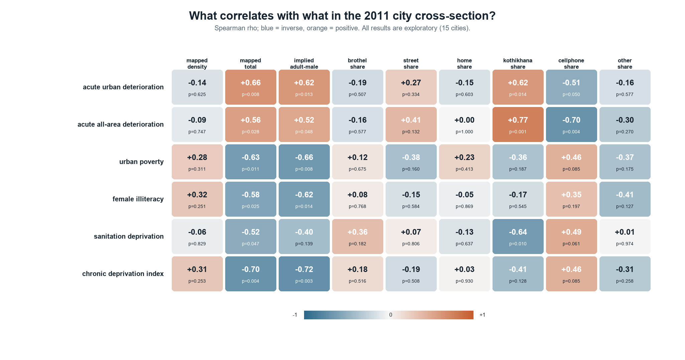
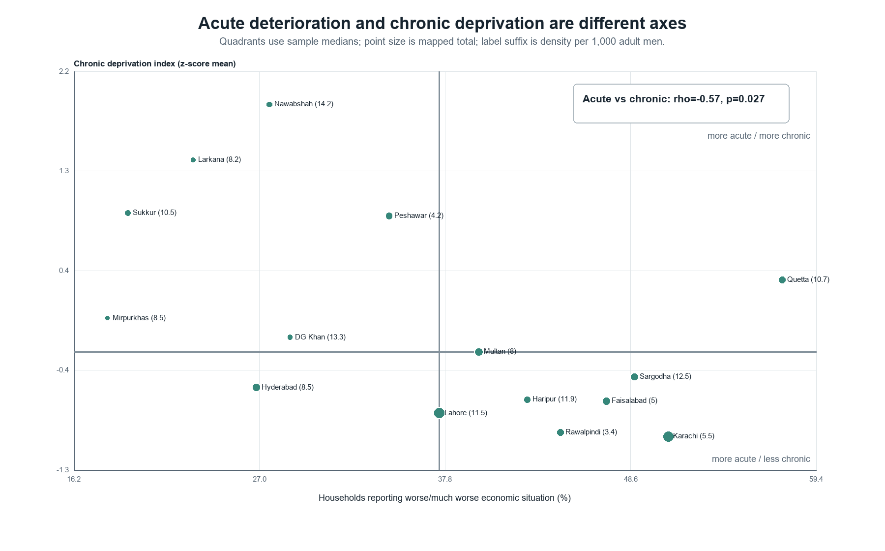
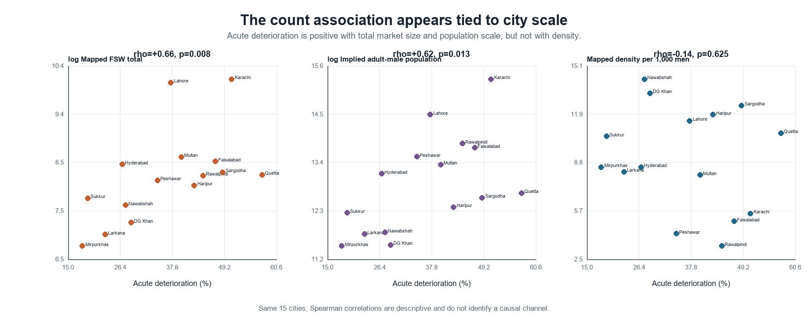
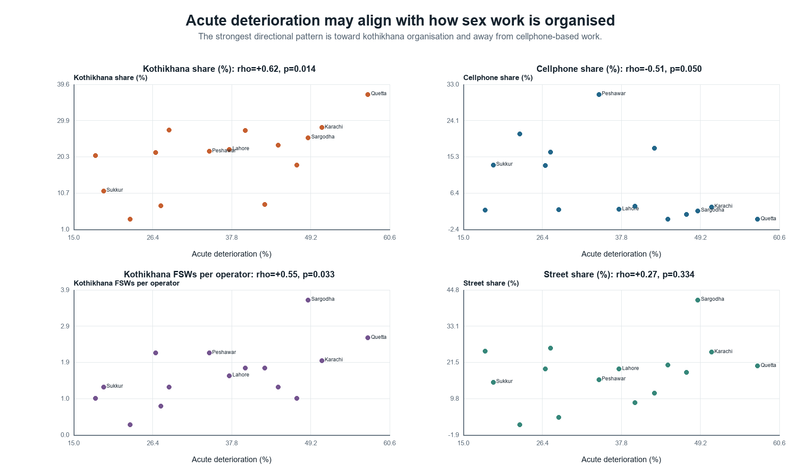
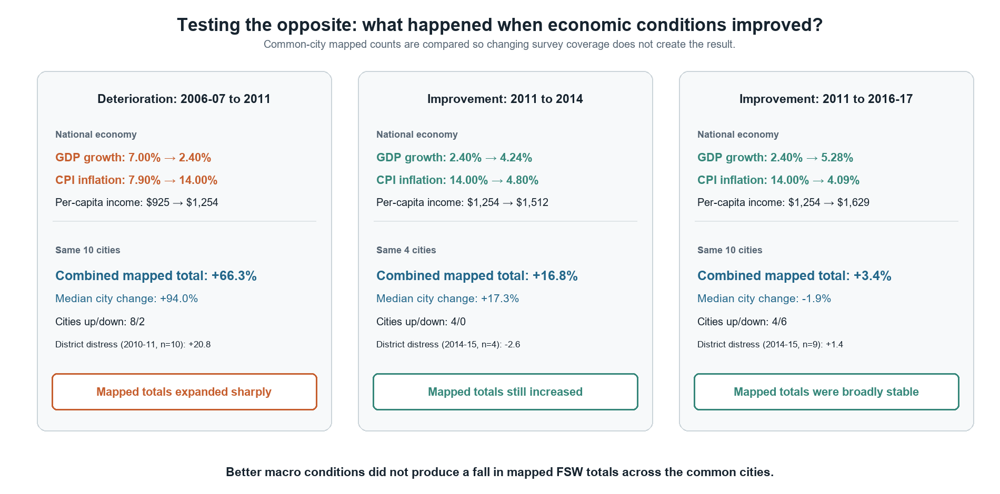
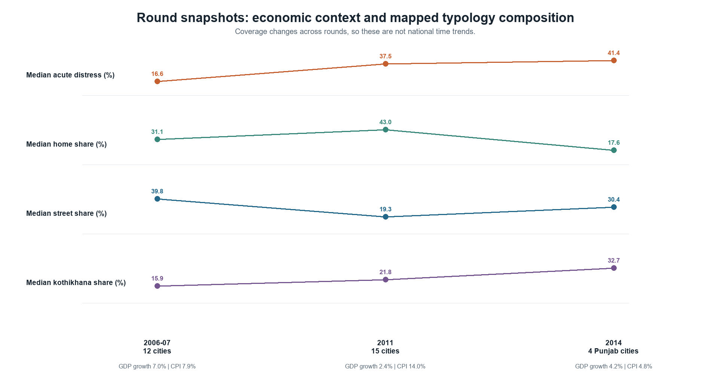

# Exploratory synthesis: pairing the sex-work mapping and economic surveys

> Status: hypothesis-generating. This report broadens interpretation after the frozen primary analysis. It does not convert post-hoc patterns into confirmatory findings.

## Bottom line

The inverse primary estimate is not the end of the analysis. It is one part of a more coherent two-process pattern:

1. **Acute reported deterioration appears mainly tied to large-city/market scale in these data.** It is positively associated with the absolute mapped FSW total (rho=+0.657) and implied adult-male population (rho=+0.625), but weakly inversely associated with mapped density (rho=-0.138). Large distressed markets contain more mapped workers, not more workers per 1,000 adult men.

2. **Chronic deprivation points in the opposite scale direction.** The exploratory index is strongly inverse with mapped total (rho=-0.700) and implied population scale (rho=-0.718), while its association with density is positive but imprecise (rho=+0.315). Smaller, chronically deprived cities can therefore have fewer workers in absolute terms yet somewhat higher mapped density.

3. **Economic conditions may be related more to organisation than prevalence.** Acute deterioration is positively associated with kothikhana share (rho=+0.618) and inversely with cellphone share (rho=-0.515). The network table adds a parallel signal: more kothikhana-based FSWs per operator where acute deterioration is higher. These patterns suggest an intermediation/venue hypothesis, not a demonstrated transition mechanism.

4. **The round snapshots show substantial typology reclassification or restructuring, but city-level economic change does not consistently explain it.** Among ten cities observed in 2006-07 and 2011, median acute distress rose 20.84 points, median home share rose 18.32 points, median street share fell 24.16 points, and median kothikhana share rose 6.99 points. With only four Punjab cities in 2014, the home/street movement partly reverses. Coverage and mapping practice remain serious competing explanations.

One association in the 54-cell outcome atlas survives Benjamini-Hochberg correction at 0.05: all-area reported deterioration versus kothikhana share (rho=+0.771; raw p=0.00076; q=0.0409). The next closest are chronic deprivation versus market scale and all-area deterioration versus cellphone share (q=0.0541). The adjusted result strengthens the structural-signal interpretation, while the rest remain hypotheses to test later.

## 1. The economic variables are not interchangeable

The key measurement fact is that the primary PSLM item asks whether the household economic situation is worse than one year earlier. It measures perceived deterioration. Poverty, female illiteracy, and sanitation deprivation measure longer-run disadvantage. In 2011, the chronic indicators move together, while acute deterioration generally moves against them.

| variable_1 | variable_2 | estimate_rho | p_value_exploratory | p_fdr_bh_within_family |
|---|---|---|---|---|
| economic_distress_urban_pct | economic_distress_all_pct | 0.904 | 0.0000 | 0.0000 |
| economic_distress_urban_pct | poverty_headcount_urban_pct | -0.489 | 0.0642 | 0.0917 |
| economic_distress_urban_pct | female_illiteracy_urban_pct | -0.360 | 0.1881 | 0.2090 |
| economic_distress_urban_pct | sanitation_deprivation_urban_pct | -0.629 | 0.0121 | 0.0403 |
| poverty_headcount_urban_pct | female_illiteracy_urban_pct | 0.880 | 0.0000 | 0.0001 |
| poverty_headcount_urban_pct | sanitation_deprivation_urban_pct | 0.583 | 0.0225 | 0.0451 |

This means the primary inverse estimate should not be paraphrased as 'poverty reduces mapped sex work.' A defensible reading is that cities experiencing greater recent deterioration were, in this cross-section, often larger and less chronically deprived. The acute item and the chronic deprivation index describe different economic states.

Using the two sample medians as descriptive cut points produces four city archetypes:

| economic_archetype | cities | n | median_density | median_mapped_total |
|---|---|---|---|---|
| low acute / high chronic | DG Khan, Larkana, Mirpurkhas, Nawabshah, Peshawar, Sukkur | 6 | 9.50 | 1712 |
| high acute / low chronic | Faisalabad, Haripur, Karachi, Lahore, Rawalpindi, Sargodha | 6 | 8.50 | 4372 |
| low acute / low chronic | Hyderabad | 1 | 8.50 | 4566 |
| high acute / high chronic | Multan, Quetta | 2 | 9.35 | 4509 |

## 2. Reconciling counts, density, and city scale

| economic axis | mapped density rho | mapped total rho | population scale rho |
|---|---|---|---|
| acute deterioration | -0.138 | 0.657 | 0.625 |
| chronic deprivation | 0.315 | -0.700 | -0.718 |

The absolute count and density questions are substantively different. A larger city can have many more mapped workers and a lower rate per adult man. The acute-distress/count correlation is therefore consistent with a scale or demand-market process, while the weak inverse density correlation says the rate is not elevated. Conversely, the chronic-deprivation pattern is consistent with smaller denominators producing higher mapped density without a larger absolute market.

The adult-male population variable is algebraically implied by the published count and density; it is a diagnostic of scale, not an independently observed population estimate.

The two-exposure models tell the same qualitative story after acute and chronic conditions are entered together, but uncertainty is wide:

| model | term | coefficient | ci_95_low | ci_95_high | p_value | r_squared |
|---|---|---|---|---|---|---|
| mapped_density | acute_distress_z | -0.065 | -0.637 | 0.507 | 0.8094 | 0.084 |
| mapped_density | chronic_deprivation_z | 0.250 | -0.602 | 1.101 | 0.5347 | 0.084 |
| log_mapped_total | acute_distress_z | 0.388 | -0.255 | 1.030 | 0.2134 | 0.446 |
| log_mapped_total | chronic_deprivation_z | -0.377 | -0.977 | 0.223 | 0.1960 | 0.446 |
| log_implied_population_scale | acute_distress_z | 0.374 | -0.327 | 1.074 | 0.2677 | 0.457 |
| log_implied_population_scale | chronic_deprivation_z | -0.400 | -0.954 | 0.154 | 0.1414 | 0.457 |
| kothikhana_share | acute_distress_z | 0.432 | -0.554 | 1.418 | 0.3588 | 0.379 |
| kothikhana_share | chronic_deprivation_z | -0.267 | -1.071 | 0.537 | 0.4834 | 0.379 |
| cellphone_share | acute_distress_z | -0.152 | -0.986 | 0.682 | 0.6983 | 0.400 |
| cellphone_share | chronic_deprivation_z | 0.540 | -0.203 | 1.282 | 0.1394 | 0.400 |

All coefficients are standardized and use HC3 standard errors. With 15 cities and correlated predictors, they are descriptive separation exercises, not stable adjusted effects.

## 3. A possible organisation channel

The simple rank association of acute deterioration with kothikhana share is +0.618 (unadjusted exploratory p=0.0141); the association with cellphone share is -0.515 (p=0.0496). In the separately published network table, acute deterioration is associated with average kothikhana-based FSWs per operator (rho=+0.552).

| exposure_label | network_outcome | estimate_rho | p_value_exploratory | p_fdr_bh_within_family |
|---|---|---|---|---|
| acute urban deterioration | avg_kothikhana_fsw_per_operator | 0.552 | 0.0330 | 0.3400 |
| mapped density | avg_home_fsw_per_operator | 0.522 | 0.0457 | 0.3400 |
| mapped density | avg_networked_fsw_per_operator | 0.502 | 0.0567 | 0.3400 |

One hypothesis is that adverse short-run conditions in large urban markets correlate with more venue-mediated or operator-mediated organisation, while direct cellphone solicitation is more visible in different city economies. But the typologies overlap, shares are compositional, and network mapping used snowball procedures. The evidence cannot show that distress moved workers from one category to another.

## 4. What the multi-period pairing can and cannot say

| round_id | cities | median_acute_distress_pct | median_female_illiteracy_pct | median_sanitation_deprivation_pct | median_home_share_pct | median_street_share_pct | median_kothikhana_share_pct | real_gdp_growth_pct | cpi_inflation_pct |
|---|---|---|---|---|---|---|---|---|---|
| 2006_07 | 12 | 16.56 | 37.00 | 5.08 | 31.06 | 39.79 | 15.94 | 7.00 | 7.90 |
| 2011 | 15 | 37.47 | 32.00 | 3.00 | 42.97 | 19.34 | 21.77 | 2.40 | 14.00 |
| 2014 | 4 | 41.40 | 27.00 | 1.50 | 17.60 | 30.43 | 32.66 | 4.24 | 4.80 |

| comparison | paired_cities | median_delta_economic_distress_urban_pct | median_delta_home_share_pct | median_delta_street_share_pct | median_delta_kothikhana_share_pct |
|---|---|---|---|---|---|
| 2006_07_to_2011 | 10 | 20.84 | 18.32 | -24.16 | 6.99 |
| 2011_to_2014 | 4 | -2.65 | -26.10 | 17.11 | 7.85 |

### Direct test of better economic conditions

Reversing the question produces a clear result: better national economic conditions after 2011 did **not** lead to fewer mapped sex workers in the common cities.

| comparison | common_cities | delta_real_gdp_growth_pp | delta_cpi_inflation_pp | aggregate_fsw_total_pct_change | median_city_fsw_pct_change | cities_with_count_increase | cities_with_count_decrease | median_delta_economic_distress_urban_pct | median_delta_home_share_pct | median_delta_street_share_pct | median_delta_kothikhana_share_pct |
|---|---|---|---|---|---|---|---|---|---|---|---|
| 2006_07_to_2011 | 10 | -4.60 | 6.10 | 66.25 | 93.97 | 8 | 2 | 20.84 | 18.32 | -24.16 | 6.99 |
| 2011_to_2014 | 4 | 1.84 | -9.20 | 16.77 | 17.31 | 4 | 0 | -2.65 | -26.10 | 17.11 | 7.85 |
| 2011_to_2016_17 | 10 | 2.88 | -9.91 | 3.36 | -1.94 | 4 | 6 | 1.44 | NA | NA | NA |

Formal paired-city comparisons confirm that the change was much faster during deterioration: the common-city mapped total grew at an approximate annualized rate of 11.96% before 2011, 5.30% from 2011 to 2014, and 0.60% from 2011 to 2016-17. Exact sign tests and city-level distress-change correlations are shown below.

| comparison | annualized_aggregate_fsw_change_pct | exact_sign_test_p_two_sided | paired_n_distress_count_change | rho_distress_change_vs_log_count_change | p_distress_change_vs_log_count_change |
|---|---|---|---|---|---|
| 2006_07_to_2011 | 11.959 | 0.109 | 10 | -0.382 | 0.276 |
| 2011_to_2014 | 5.304 | 0.125 | 4 | -0.400 | NA |
| 2011_to_2016_17 | 0.603 | 0.754 | 9 | 0.417 | 0.265 |

The city-level distress-change correlations do not have a stable direction (-0.382, -0.400 and +0.417). The macro-period pattern therefore describes expansion followed by persistence; it does not show that the cities with the largest local improvement experienced the largest count reductions.

From 2011 to 2014, GDP growth improved by 1.84 points and CPI inflation fell by 9.20 points. Reported distress declined modestly in the four common cities, but every one of those cities had a higher mapped FSW count; their combined total rose 16.77%. The composition changed more clearly: median home-based share fell 26.10 points, street share rose 17.11 points, and kothikhana share rose 7.85 points.

Across the longer 2011 to 2016-17 improvement, the ten common cities were essentially stable in aggregate: their mapped total increased 3.36%, while the median city changed -1.94%; four cities increased and six decreased. Thus, improvement is associated with persistence and reorganisation, not a general contraction of the mapped sex-work population. This is an asymmetric, ratchet-like pattern: deterioration coincides with expansion, while recovery does not undo the expansion.

The 2011 mapping coincides with a nationally difficult macroeconomic setting: 2.4% real GDP growth and 14.0% CPI inflation in the reviewed Economic Survey overview, following flood and oil-price shocks. That context makes the large jump in reported deterioration plausible. It does not identify a city-level causal effect because the macro values are national and there are only three structurally comparable mapping snapshots.

Round totals and medians cannot be read as national trends: the city sets change (12 cities in 2006-07, 15 in 2011, and four Punjab cities in 2014), typology measurement can change, and 2016-17 lacks comparable city density and typology detail.

## 5. Nonlinearity does not rescue the density story

| model | degree | loocv_rmse_density | n | rmse_relative_to_constant |
|---|---|---|---|---|
| constant | 0 | 3.525 | 15 | 1.000 |
| polynomial_degree_1 | 1 | 3.661 | 15 | 1.039 |
| polynomial_degree_2 | 2 | 4.034 | 15 | 1.145 |
| polynomial_degree_3 | 3 | 3.717 | 15 | 1.055 |

A constant-only model has the lowest leave-one-city-out prediction error. Linear, quadratic, and cubic specifications all perform worse. The existing data therefore do not support a useful U-shaped or threshold model for mapped density.

## 6. Hypotheses worth testing next

- **Shock versus level:** acute deterioration and chronic deprivation have distinct associations with market scale and density.
- **Market scale/demand:** short-run urban stress may be concentrated in large labour and client markets, raising absolute numbers without raising per-capita density.
- **Intermediation:** acute stress may correlate with kothikhana/operator-based organisation rather than prevalence.
- **Small-city vulnerability:** chronic deprivation may matter for density because smaller cities have fewer adult men, even when absolute FSW totals are lower.
- **Visibility and mapping effort:** observed organisation shifts may reflect where and how mapping teams could enumerate workers.
- **Asymmetric recovery:** downturn-related expansion may persist after growth and inflation improve, while visible work arrangements change.

The corresponding falsification tests and data requirements are in `results/tables/exploratory_hypothesis_ledger.csv`.

## 7. Boundaries

- All city correlations are ecological and based on 15 observations.
- The chronic deprivation index was constructed after the primary analysis and is exploratory.
- FSW mapping estimates are programmatic enumeration estimates, not a census.
- City outcomes are paired to district urban strata; match quality varies.
- Typology shares are compositional and categories can overlap or change over time.
- The network operator table comes from a supplementary snowball mapping process and is not a denominator for total FSW counts.
- Multiple comparisons are substantial; nominal p-values are navigation aids, not discoveries.
- Mechanisms such as labour displacement, migration, client demand, entry into sex work, or movement across typologies are not directly measured.

## Reproducible artifacts

- `data/processed/paper1_2011_exploratory_features.csv`: 2011 joined feature table.
- `data/processed/paper1_2011_network_structure.csv`: source-parsed network table.
- `data/processed/paper1_round_macro_context.csv`: reviewed national macro context with locators.
- `results/tables/exploratory_*.csv`: full coefficient, correlation, city-archetype, transition, and hypothesis tables.
- `results/diagnostics/exploratory_validation.md`: executable validation evidence.
